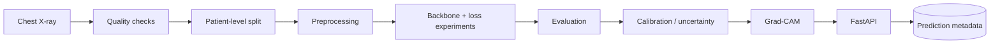
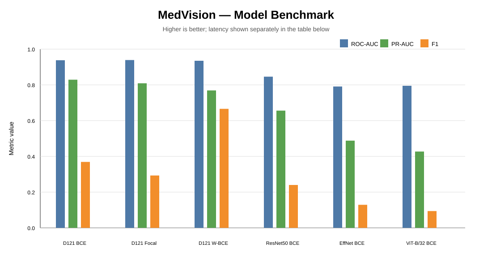
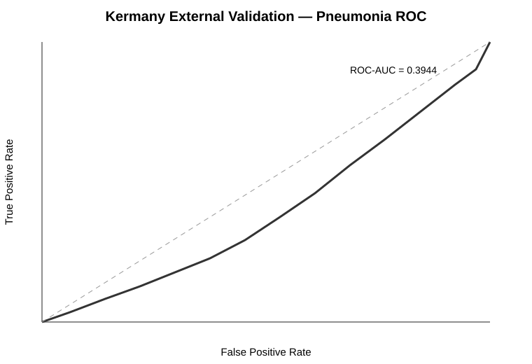
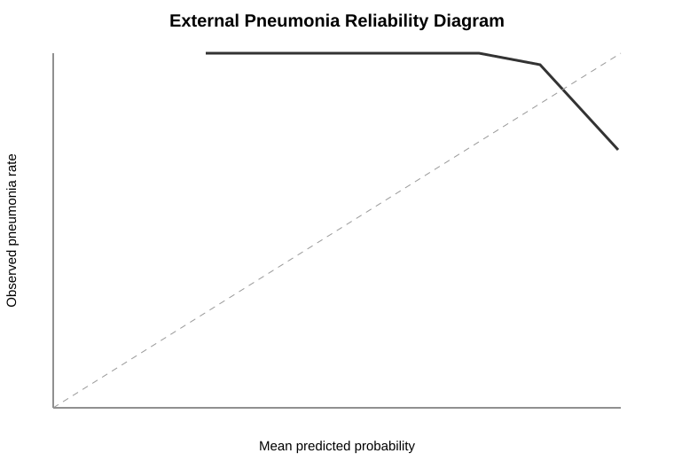
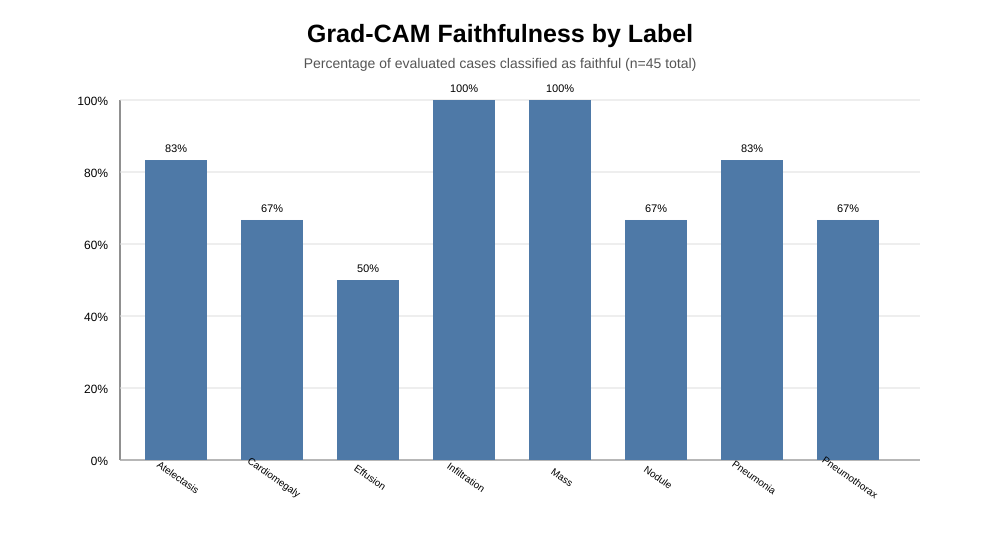

# MedVision

**Explainable medical computer vision for multi-label chest X-ray analysis — from data quality and patient-safe splitting to model evaluation, uncertainty, Grad-CAM, and API deployment.**

[](https://github.com/Rollins1989/MedVision/actions/workflows/ci.yml)
[](https://www.python.org/)
[](https://pytorch.org/)
[](https://fastapi.tiangolo.com/)
[](https://docs.pytest.org/)
[](https://codecov.io/gh/Rollins1989/MedVision)

> **Research / educational prototype. Not for clinical diagnosis or treatment decisions.**

## Why MedVision?

Medical imaging models are easy to benchmark superficially and much harder to evaluate responsibly. MedVision was built around the full ML lifecycle:

**data quality → patient-level splitting → multi-label training → backbone/loss ablation → evaluation → calibration → uncertainty → explainability → API deployment**

The project deliberately reports trade-offs and negative findings instead of presenting one attractive metric in isolation.

## What it does

- Multi-label classification of **8 thoracic findings**
- Compares **ResNet50, DenseNet121, EfficientNet-B0, ViT-B/16 and ViT-B/32**
- Compares **BCE, Weighted BCE and Focal Loss**
- Uses **patient-level train/validation/test splitting** to prevent patient leakage
- Evaluates ROC-AUC, PR-AUC, F1, sensitivity, specificity and latency
- Provides MC-Dropout uncertainty estimation
- Generates Grad-CAM explanations for CNN backbones
- Tests explanation faithfulness
- Evaluates temperature-scaling calibration
- Exposes inference through a FastAPI service
- Persists prediction metadata with SQLAlchemy
- Tracks experiments with MLflow
- Includes Docker and GitHub Actions CI

## Architecture

See the full [architecture documentation](docs/ARCHITECTURE.md).



## Dataset quality snapshot

| Audit item | Count |
|---|---:|
| Total images | 454 |
| Valid images | 430 |
| Corrupted | 6 |
| Duplicates | 12 |
| Blank | 3 |
| Invalid channels | 3 |
| Missing labels | 0 |

The complete data documentation is in the [Data Card](docs/DATA_CARD.md).

## Benchmark

Current benchmark results:

| Model | Loss | ROC-AUC | PR-AUC | F1 | Sensitivity | Specificity | Latency |
|---|---|---:|---:|---:|---:|---:|---:|
| DenseNet121 | BCE | 0.9380 | 0.8287 | 0.3687 | 0.3085 | 0.9972 | 30.2 ms |
| DenseNet121 | Focal | **0.9394** | 0.8086 | 0.2928 | 0.2103 | 0.9956 | 30.1 ms |
| **DenseNet121** | **Weighted BCE** | 0.9354 | 0.7689 | **0.6656** | **0.9765** | 0.8080 | 28.5 ms |
| ResNet50 | BCE | 0.8455 | 0.6561 | 0.2396 | 0.1954 | 0.9958 | 31.1 ms |
| EfficientNet-B0 | BCE | 0.7914 | 0.4876 | 0.1292 | 0.1032 | 1.0000 | **9.7 ms** |
| ViT-B/32 | BCE | 0.7946 | 0.4274 | 0.0938 | 0.1071 | 0.9933 | 107.2 ms |



### How to read this table

There is **no single best configuration across all metrics**.

- **Highest ROC-AUC:** DenseNet121 + Focal, 0.9394.
- **Highest F1/sensitivity:** DenseNet121 + Weighted BCE, 0.6656 / 0.9765.
- **Specificity trade-off:** Weighted BCE falls to 0.8080 specificity.
- **Fastest:** EfficientNet-B0, 9.7 ms, but with weaker predictive performance.
- **Slowest:** ViT-B/32, 107.2 ms, without outperforming DenseNet121 in this benchmark.

The API defaults to the DenseNet121 + Weighted BCE checkpoint because it is the strongest **high-sensitivity operating configuration** in the current experiment set—not because it wins every metric.

Full interpretation is documented in the [Model Card](docs/MODEL_CARD.md) and [Experiment Registry](docs/EXPERIMENTS.md).


## External validation: important negative finding

A frozen DenseNet121 + Weighted BCE checkpoint was evaluated on the complete **5,856-image Kermany/Guangzhou pediatric chest X-ray cohort** available in the Kaggle input. No retraining or threshold optimization was performed on the external labels.

| Metric | Kermany external evaluation |
|---|---:|
| Images evaluated | **5,856** |
| ROC-AUC | **0.3944** |
| Average Precision | **0.6696** |
| Accuracy @ 0.5 | **72.90%** |
| Sensitivity @ 0.5 | **99.91%** |
| Specificity @ 0.5 | **0.00%** |
| F1 @ 0.5 | **84.33%** |
| Mean Pneumonia probability | **0.9938** |
| Median Pneumonia probability | **0.9980** |

At the fixed 0.5 threshold, the confusion matrix is:

~~~text
                 Predicted
              Normal  Pneumonia
Actual Normal      0       1583
       Pneumonia   4       4269
~~~

The model therefore labels **all 1,583 Normal images as Pneumonia**. The high sensitivity is not evidence of good external performance because specificity is zero and the score distribution is severely overconfident.

This is reported as a **domain-shift/failure-analysis finding**, not as clinical validation. The external cohort is pediatric (ages 1–5) and exposes only a binary Normal/Pneumonia endpoint, so this experiment evaluates only MedVision's Pneumonia output.

See [External Validation](docs/EXTERNAL_VALIDATION.md) for the full protocol, provenance, limitations, bootstrap analysis and published artifacts.





## Explainability

Grad-CAM is implemented for CNN backbones and evaluated rather than assumed to be faithful.



Current faithfulness evaluation:

- 45 image-label cases
- Mean faithfulness margin: **0.1044**
- Faithful cases: **75.56%**

Faithfulness varies substantially by label. This is why Grad-CAM is treated as an interpretability aid, not proof of clinical reasoning.

See [Results](reports/RESULTS.md) for the visual summary.

## Calibration: a documented negative result

Temperature scaling was tested on the selected checkpoint.

- ECE before: **0.2394**
- ECE after: **0.2735**
- Change: **-0.0341**

Calibration therefore **did not improve** under the tested configuration. The result remains documented as a negative experiment, with per-label calibration and isotonic regression identified as follow-up work.

## Research questions

MedVision is structured around explicit questions:

1. **Backbone effect:** does architecture materially change multi-label performance?
2. **Loss effect:** how does class-imbalance handling change sensitivity/specificity?
3. **Calibration:** can confidence estimates be improved reliably?
4. **Explainability:** are Grad-CAM regions faithful to the model signal?
5. **Thresholding:** should each label use its own validation-derived threshold?

See [EXPERIMENTS.md](docs/EXPERIMENTS.md) for the decision log and next experiments.

## Project structure

```text
MedVision/
├── app/                  # FastAPI application and persistence
├── src/
│   ├── data/             # validation, cleaning, patient-level splitting
│   ├── models/           # backbone factory
│   ├── training/         # losses and training utilities
│   └── explainability/   # Grad-CAM
├── configs/              # experiment configuration
├── reports/              # benchmark, calibration and faithfulness reports
│   └── figures/          # repository-rendered result visuals
├── docs/                 # architecture, data/model cards, experiment registry
├── tests/                # pipeline and API tests
├── frontend/             # demo UI
├── Dockerfile
├── docker-compose.yml
└── .github/workflows/    # CI
```

## Quick start

### 1. Clone

```bash
git clone https://github.com/Rollins1989/MedVision.git
cd MedVision
```

### 2. Install

Python 3.12 is the tested CI runtime.

```bash
python -m venv .venv
# Windows
.venv\\Scripts\\activate
# macOS/Linux
source .venv/bin/activate

pip install -r requirements.txt

# Optional developer tooling
pip install -e ".[dev]"
pre-commit install
```

### 3. Run tests

```bash
pytest -q
```

### 4. Start the API

```bash
uvicorn app.main:app --reload
```

Then open the FastAPI documentation at `/docs`.

## API endpoints

| Method | Endpoint | Purpose |
|---|---|---|
| GET | `/health` | Service/model health |
| GET | `/model-info` | Loaded model metadata and metrics |
| POST | `/predict` | Multi-label prediction |
| POST | `/explain` | Prediction + Grad-CAM explanation |
| GET | `/prediction/{id}` | Retrieve persisted prediction metadata |

## Documentation

| Document | Purpose |
|---|---|
| [API Examples](docs/API_EXAMPLES.md) | cURL, Python, errors and OpenAPI |
| [Architecture](docs/ARCHITECTURE.md) | System and inference design |
| [Data Card](docs/DATA_CARD.md) | Dataset, quality, split and limitations |
| [Calibration](docs/CALIBRATION.md) | Disjoint-split calibration experiment |
| [Model Card](docs/MODEL_CARD.md) | Model purpose, metrics, risks and limitations |
| [Experiment Registry](docs/EXPERIMENTS.md) | Research questions and decision log |
| [Failure Analysis](docs/FAILURE_ANALYSIS.md) | Failure modes, trade-offs and next experiments |
| [External Validation](docs/EXTERNAL_VALIDATION.md) | Independent-dataset evaluation protocol and harness |
| [Kaggle External Validation](notebooks/external_validation_kermany.ipynb) | Run the frozen model on the complete Kermany/Guangzhou cohort |
| [Results](reports/RESULTS.md) | Visual benchmark and explainability summary |
| [Experiment table](reports/experiment_table.md) | Raw benchmark table |
| [Calibration report](reports/calibration_report.json) | Calibration evidence |
| [Faithfulness report](reports/faithfulness_report.json) | Grad-CAM faithfulness evidence |

## Testing and reproducibility

The repository includes automated tests covering:

- Data quality checks
- Patient-level split integrity
- Supported model forward passes
- Loss functions
- API validation and response schema
- Prediction persistence/retrieval
- Grad-CAM behavior
- OpenAPI documentation
- Docker build

The CI workflow installs a CPU-compatible PyTorch environment, runs linting/tests, creates a synthetic training artifact for API tests, and builds the Docker image.

## Limitations

This is not a clinical validation study. The current evidence is limited by dataset size, population coverage, external-validation availability, label quality, calibration quality, and the known limitations of post-hoc visual explanations.

The project now includes a completed frozen-checkpoint external evaluation on the Kermany/Guangzhou pediatric cohort. That experiment is intentionally treated as a robustness stress test rather than clinical validation and documents a substantial domain-shift failure. Calibration experiments now compare raw probabilities, global temperature scaling, and per-label sigmoid calibration on a disjoint calibration split.

## Disclaimer

**MedVision is a research/educational prototype. It is not intended to diagnose, treat, prevent, or rule out any medical condition. Predictions and explanations must not be used as a substitute for qualified clinical judgment.**
