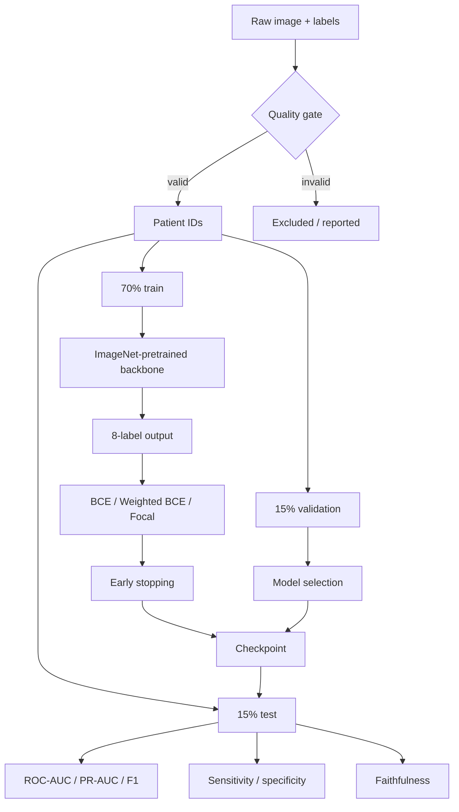
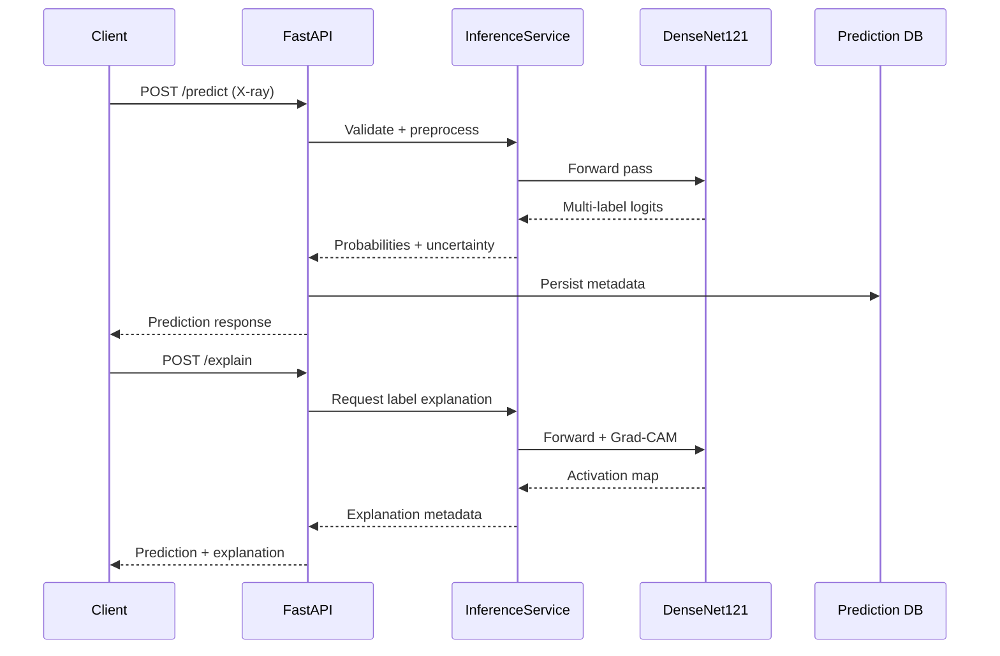

# MedVision Architecture

## System overview

MedVision is organized as a reproducible medical-computer-vision pipeline:

```mermaid
flowchart LR
    A[Chest X-ray images] --> B[Data quality checks]
    B --> C[Patient-level split]
    C --> D[Preprocessing & augmentation]
    D --> E[Backbone experiments]
    E --> F[Multi-label classification head]
    F --> G[Loss comparison]
    G --> H[Validation / test evaluation]
    H --> I[Threshold & calibration analysis]
    I --> J[Uncertainty estimation]
    J --> K[Grad-CAM explainability]
    K --> L[FastAPI inference service]
    L --> M[(Prediction metadata)]
```

## Training pipeline

## Inference architecture

## Design principles

1. **Patient-level isolation:** all images from a patient remain in one split.
2. **Multi-label prediction:** each thoracic finding has an independent output probability.
3. **Imbalance-aware training:** BCE, weighted BCE, and focal loss are compared rather than assuming one loss is universally best.
4. **Model selection by multiple metrics:** ROC-AUC is considered alongside PR-AUC, F1, sensitivity, specificity, and latency.
5. **Explainability is evaluated:** Grad-CAM is accompanied by a faithfulness test rather than presented as inherently trustworthy.
6. **Deployment separation:** model inference is exposed through FastAPI while persistence is handled independently through SQLAlchemy.
7. **Research honesty:** unsuccessful calibration and known explainability limitations remain part of the project record.

See [MODEL_CARD.md](MODEL_CARD.md), [DATA_CARD.md](DATA_CARD.md), and [EXPERIMENTS.md](EXPERIMENTS.md) for the evidence behind these design decisions.
